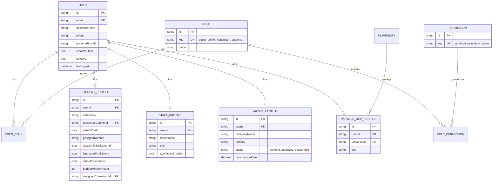
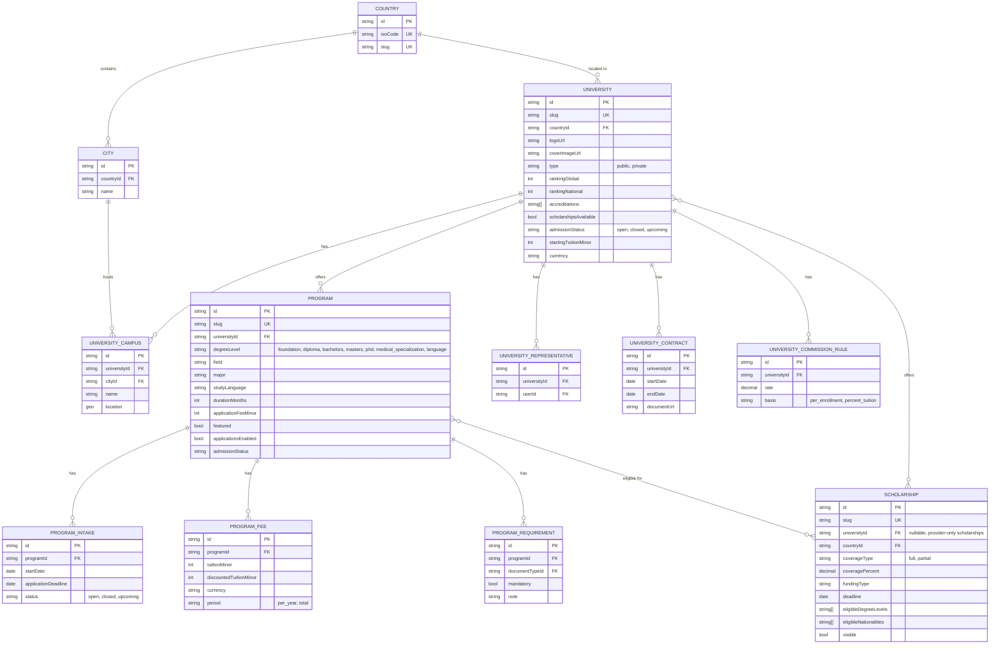
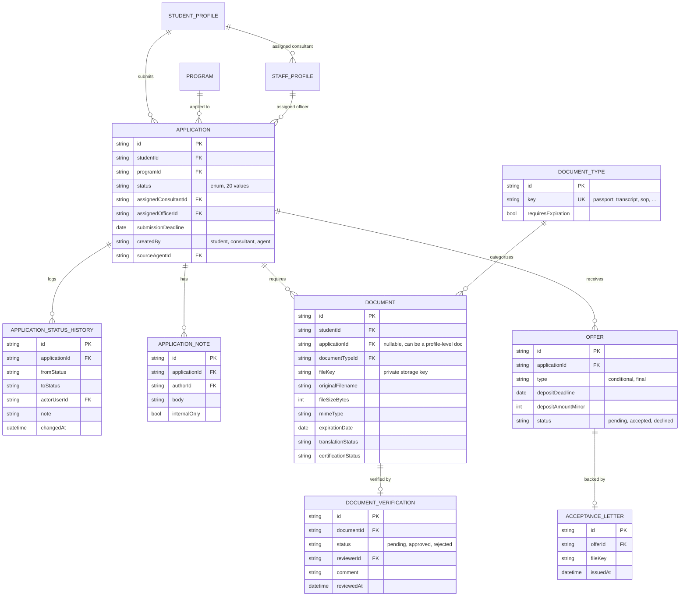
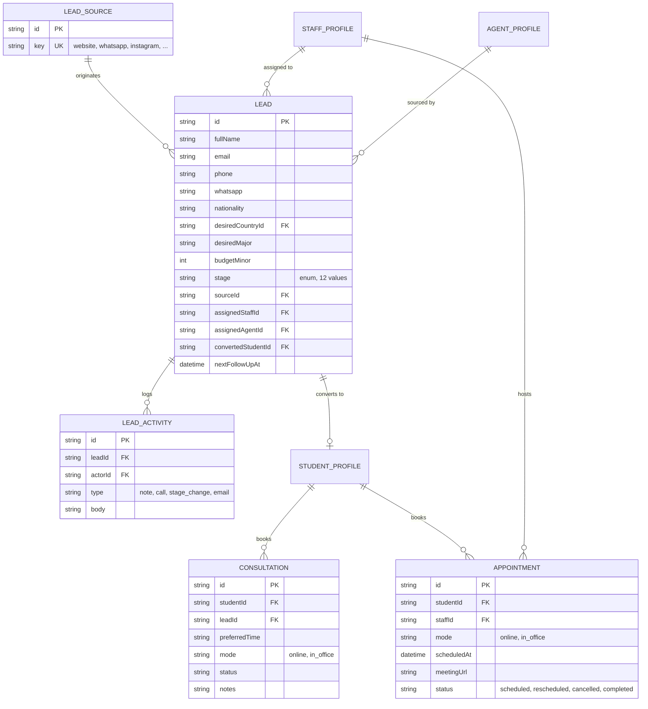
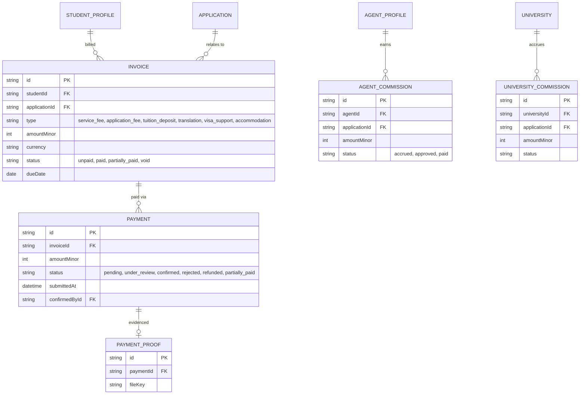
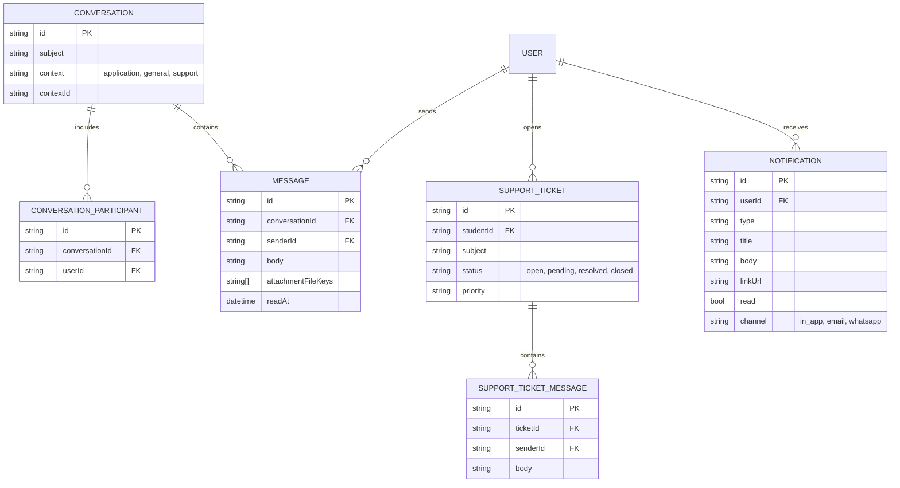
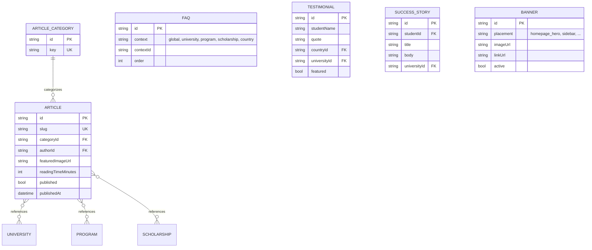
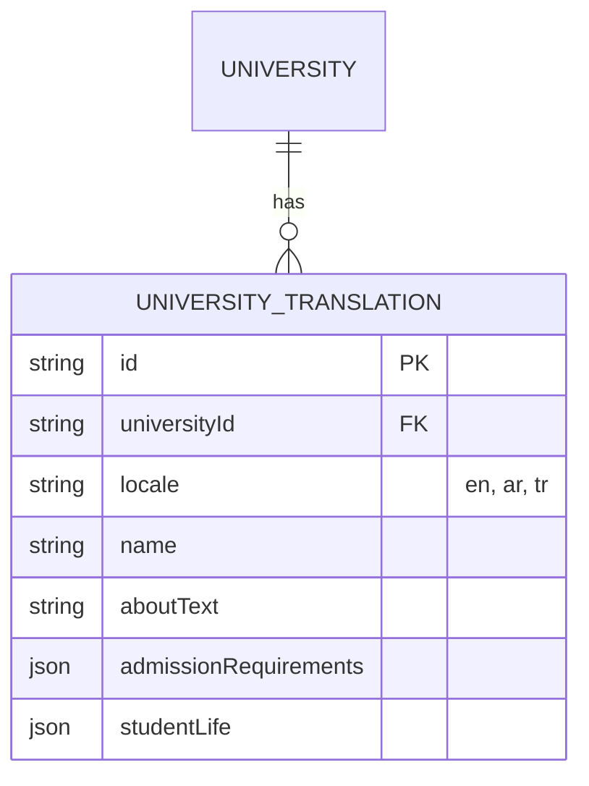
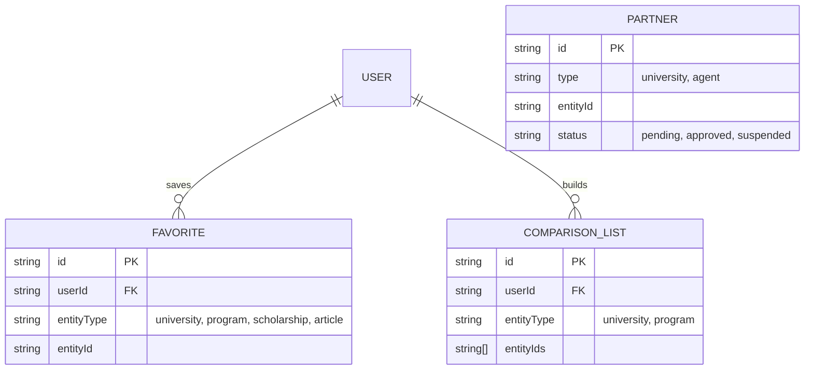
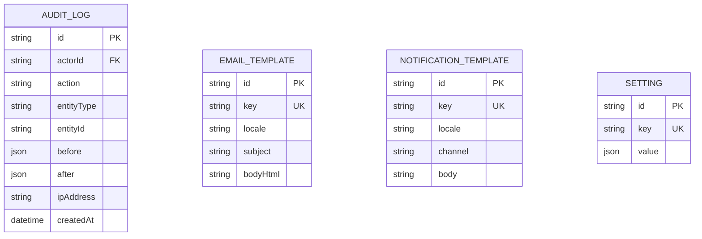

# Database Schema & ERD

Full implementation lives in `prisma/schema.prisma` (source of truth). This document
gives the conceptual model grouped by domain, since a single 60+-entity diagram is
unreadable. All tables include `id (cuid)`, `createdAt`, `updatedAt`, `deletedAt`
(soft delete) unless noted; audit-sensitive tables additionally get `createdById`.

## Conventions

- Soft delete: `deletedAt DateTime?`; all repository queries default-filter `deletedAt: null`.
- Money: `amountMinor Int` + `currency String (ISO 4217)`.
- Localized text fields (name/description/etc. on catalog + content entities) live in a
  companion `*Translation` table keyed by `(entityId, locale)` rather than duplicate
  columns per language — this is the **Localized Content pattern** referenced by every
  domain below.
- Enums are defined once in Prisma and reused (`ApplicationStatus`, `LeadStage`, etc.)

---

## 1. Identity & Access

## 2. Catalog: Geography, Universities & Programs

## 3. Applications, Documents, Offers

## 4. CRM: Leads, Consultations, Appointments

## 5. Payments & Finance

## 6. Communication & Notifications

## 7. Content (CMS)

Every content entity above (`University`, `Program`, `Scholarship`, `Article`,
`Country` study guides, `FAQ`, `Testimonial`) has a matching `*Translation` table:

(identical pattern applied to `ProgramTranslation`, `ScholarshipTranslation`,
`ArticleTranslation`, `CountryGuideTranslation`, `FAQTranslation`)

## 8. Favorites, Comparison, Partners

## 9. Platform / System

## 10. Enumerations (Prisma `enum`)

- `ApplicationStatus` — the 20 values listed in the product spec (`Draft` … `Closed`).
- `LeadStage` — the 12 values listed in the product spec.
- `LeadSourceKey`, `DegreeLevel`, `PaymentStatus`, `DocumentVerificationStatus`,
  `ScholarshipCoverageType`, `AppointmentMode`, `AppointmentStatus`,
  `AgentStatus`, `PartnerStatus`.

All enums are centralized at the top of `prisma/schema.prisma` and re-exported as
TypeScript types via `@prisma/client` — never redefined ad hoc in application code.
